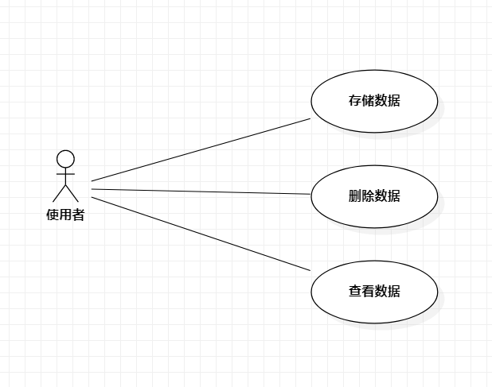

# 实验2：用例建模

## 1.实验目标
- 使用Markdown编写报告
- 细化选题
- 学习使用StarUML用例建模

## 2.实验内容
- 创建用例图
- 编写实验报告文档
- 编写用例规约

## 3.实验步骤
- 选题
- 确定本系统的参与者与事件
- 确定用例：
注册、
登录、
存储数据、
查询数据、
删除数据
- 建立使用者与用例之间的关系
- 编写用例规约

## 4.实验结果

图1：智慧家庭系统的用例图1

图2：智慧家庭系统的用例图2

## 表1：登录用例规约  

用例编号  | UC01 | 备注  
-|:-|-  
用例名称  | 登录  |   
前置条件  |      |    
后置条件  | 使用者进入智慧家庭系统首页 |    
基本流程  | 1. 使用者点击登录按钮；  |    
~| 2. 系统显示登录页面；  |   
~| 3. 使用者输入用户名和密码，点击登录按钮；  |   
~| 4. 系统**查询到**用户信息，检查用户名与密码**相匹配**，记录用户登录状态；  |   
~| 5. 系统显示首页。  |  
扩展流程  | 4.1 系统检查发现用户不存在，**提示“用户不存在”**；  |    
~| 4.2 系统检查发现用户名与密码不匹配，**提示“密码不正确”**。  |

## 表2：查询数据用例规约  

用例编号  | UC02 | 备注  
-|:-|-  
用例名称  | 查询数据  |   
前置条件  |  使用者登陆成功并进入系统首页    |    
后置条件  |     |    
基本流程  | 1. 使用者点击查看数据按钮；  |*用例执行成功的步骤*    
~| 2. 系统跳转至查询数据页面；  |*页面有“今日数据”和“过往数据”两个按钮*
~| 3. 使用者点击查看过往数据数据按钮；  |
~| 4. 系统跳转至具体的已存档的数据页面并显示各项数据；  |
扩展流程  | 2.1 网卡导致页面未显示，**提示“页面显示不成功”**；  |*用例执行失败*  
~| 3.1 系统检查发现无存档数据，**提示“无过往数据、请存储相关数据”**。  |

## 表3：存储数据用例规约  

用例编号  | UC03 | 备注  
-|:-|-  
用例名称  | 存储数据  |   
前置条件  | 使用者进入智慧家庭系统查询数据页面     |    
后置条件  | 使用者进入智慧家庭系统今日数据页面          |    
基本流程  | 1. 使用者点击存储数据按钮；  |    
~| 2. 系统显示**“已成功存储数据”**；  |         
扩展流程  | 2.1 系统检查发现磁盘空间不足，**提示“磁盘空间不足，存储失败”**；  |    
